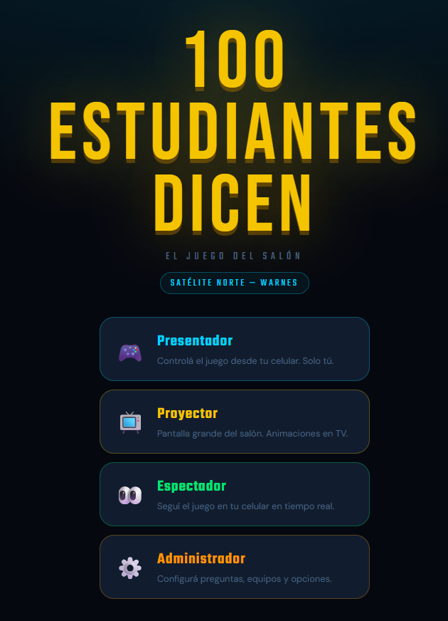
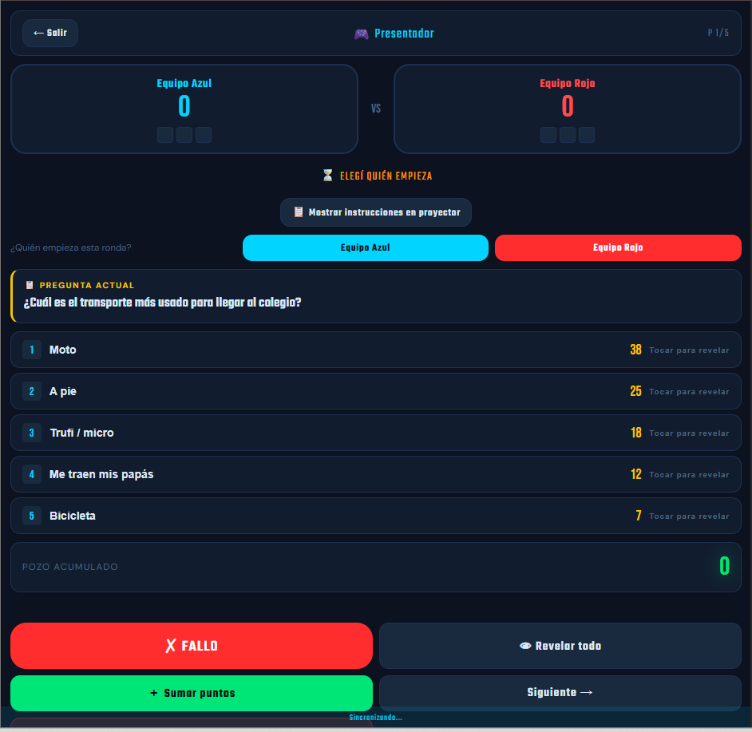
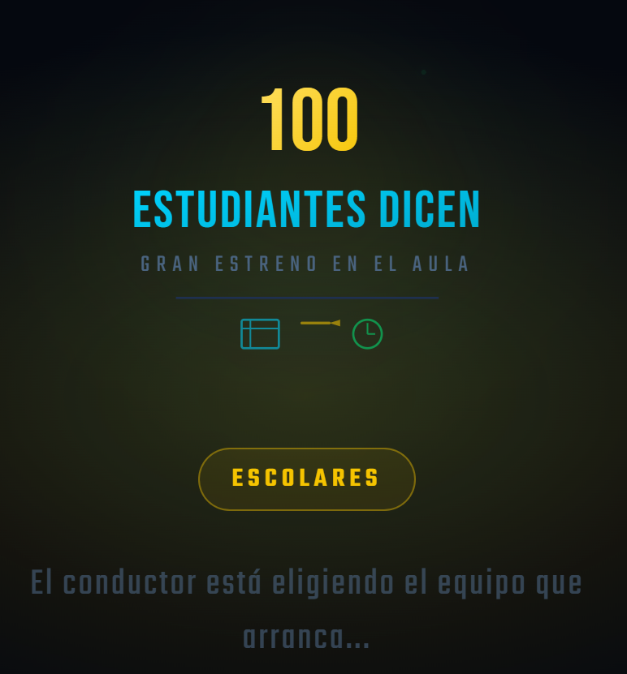
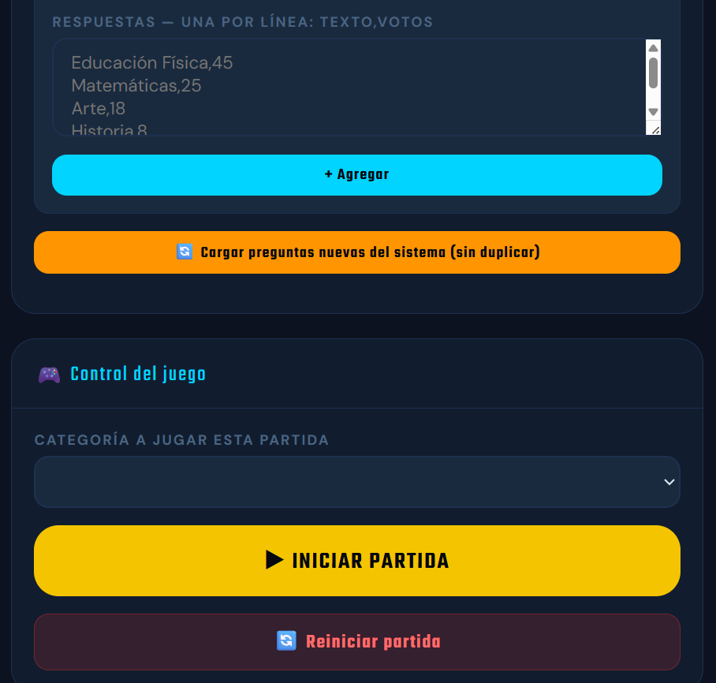

<div align="center">



# 🎮 100 Estudiantes Dicen

### Plataforma interactiva en tiempo real para dinámicas grupales, aprendizaje activo y trabajo en equipo

Inspirado en el formato de concursos televisivos y adaptado para aulas, capacitaciones y actividades de integración.

[]()
[]()
[]()
[]()
[]()

### 🚀 [**Ver Demo en Vivo →**](https://100-latinos.vercel.app/)

</div>

---

## 📖 ¿Qué es esto?

**100 Estudiantes Dicen** es una plataforma web que lleva la dinámica de "encuesta y adivina la respuesta" a cualquier salón, con sincronización en tiempo real entre varios dispositivos: uno controla, uno proyecta, y el resto sigue el juego en vivo desde su celular.

Nació pensado para el aula, pero como todo el contenido (preguntas, respuestas, categorías, puntajes) es 100% editable desde un panel de administración, también funciona para:

- 🏫 Instituciones educativas y universidades
- 💼 Capacitaciones y talleres empresariales
- 🎉 Eventos y dinámicas de integración
- 👨‍👩‍👧‍👦 Reuniones familiares y actividades recreativas

---

## 🎮 Los 4 roles del sistema

El sistema separa responsabilidades en cuatro vistas independientes, todas sincronizadas en tiempo real vía Supabase:

| Rol | Función |
|---|---|
| 🎤 **Presentador** | Controla la partida desde su celular: revela respuestas, suma puntos, avanza preguntas. Solo él tiene el control. |
| 📺 **Proyector** | Pantalla grande para TV/proyector. Muestra preguntas, respuestas reveladas, puntajes y animaciones. |
| 👀 **Espectador** | Sigue el desarrollo del juego en tiempo real desde su propio dispositivo. |
| ⚙️ **Administrador** | Gestiona preguntas, respuestas, categorías y puntajes sin tocar código. |

<p align="center">

<br>
<sub>Vista del Presentador: control de equipos, revelado de respuestas y puntaje en vivo</sub>
</p>

<p align="center">

<br>
<sub>Pantalla de transición del Proyector, pensada para verse bien en TV o proyector de aula</sub>
</p>

---

## ⚙️ Panel de administración

Todo el contenido del juego se configura sin tocar una línea de código:

- ✅ Crear, editar y eliminar preguntas
- ✅ Activar o desactivar preguntas puntuales
- ✅ Cargar respuestas y votos por categoría (formato simple: `texto, votos`)
- ✅ Crear categorías ilimitadas
- ✅ Configurar puntajes y controlar el flujo de la partida (iniciar / reiniciar)

<p align="center">

<br>
<sub>Edición de respuestas por categoría y control de partida desde el panel admin</sub>
</p>

---

## 🚀 Tecnologías

- **Frontend:** HTML5, CSS3, JavaScript (Vanilla)
- **Backend / Realtime:** Supabase
- **Hosting:** Vercel

---

## 📂 Estructura del proyecto

```
100Latinos/
├── index.html
├── styles.css
├── app.js
├── supabase-config.js
├── portada.png
├── presentador.png
├── proyector.png
├── admin.png
└── README.md
```

---

## 🚀 Instalación

```bash
git clone https://github.com/david10102016/100Latinos.git
cd 100Latinos
```

Configura tus credenciales de Supabase en `supabase-config.js` y abre `index.html`, o despliega directo en Vercel.

---

## 💡 Próximas mejoras

- [ ] Sonidos personalizables
- [ ] Estadísticas y ranking histórico de partidas
- [ ] Temporizadores configurables
- [ ] Importación / exportación de preguntas
- [ ] Modo torneo
- [ ] Compatibilidad multiaula

---

## 👨‍💻 Autor

**Juan David Uscamayta Ramos**
Docente · Desarrollador de Software · Creador de herramientas tecnológicas para el ámbito educativo

[LinkedIn](#) · [GitHub](https://github.com/david10102016)

---

<div align="center">

⭐ Si este proyecto te resultó interesante, considera dejarle una estrella al repositorio.

</div>
